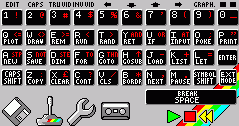
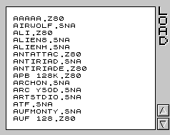
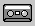
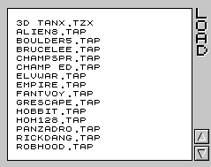
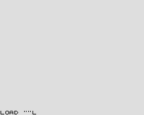
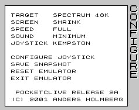
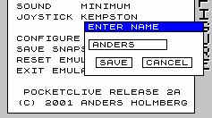
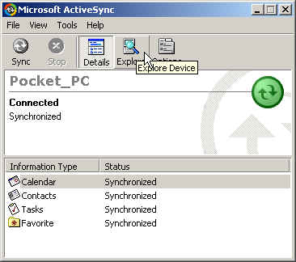
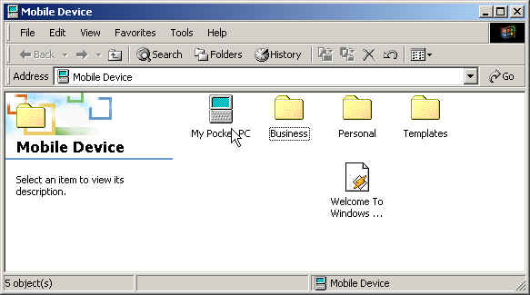
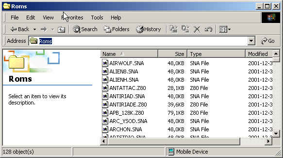

# PocketClive

ZX Spectrum emulator for PocketPC - last updated 2002-06-06. 

Put it up here for historical reasons - got no idea how to build it anymore;) 

## Features

* Supports 48k, 128k, Plus2 and Plus3
* Supports both beeper and AY sound
* Load snapshots in .z80 and .sna format
* Save snapshots in .z80 format
* Quickload tape files in .tap format
* Load tape files in .tzx format
* Kempston joystick support
* User defined joystick support

## Copyrights

* FUSE - Free Unix Spectrum Emulator version 0.4.0 - © Philip Kendall
* EasyCE - Game programming framework for PocketPC - © Jacco Bikker
* zlib - Compression library - © Jean-loup Gailly and Mark Adler
* zx32 - ZX Spectrum Emulator for Windows - © Vaggelis Kapartzianis
* A Day in the Life - Spectrum game - © Stephen J. Redman/Micromega

## Manual

**Joystick and keyboard support**

PocketClive supports a virtual keyboard that operates just like the keyboard on your old Spectrum (it is actually a bit like the Spectrum 48k+ because of the Ext Mode button). The CAPS SHIFT and SYMBOL SHIFT keys are sticky, i.e. when pressed the stay pressed until another key is pressed. There are two small squares on the top right corner of the keyboard that indicates if the CAPS SHIFT or SYMBOL SHIFT button currently is active.

Note : Backspace can be reached by pressing CAPS SHIFT and 0.

  

The keyboard also has a number of action buttons on the bottom row :

-   Load snapshots
-   Switch between virtual keyboard and virtual joystick
-   Configure PocketClive
-   Load tape files
-   Tape controls

When switched to the virtual joystick the keyboard image disappears and 9 squares representing the 8 directions on a joystick and a fire button appears. This virtual joystick can be used together with the joypad and buttons on your PocketPC. The joypad is priority over the virtual joystick, i.e. if the joypad is pressed to the right and the virtual joystick to the left Miner Willy will move to the right (but it is possible to combine e.g. up and right).

**Loading snapshots** 

Snapshots are loaded by pressing the disk button (PocketClive must be in emulation mode otherwise this button is deactivated).

Snapshots are sorted in alphabetic order and to load just point the pen to the name and click. Snapshots can be in either .sna or .z80 format. If you have snapshots in other formats there are conversion tools available from <http://www.worldofspectrum.org>. When loading a snapshot PocketClive automatically switches between a 48k model and a 128k model depending on the snapshot (this is not evident in the configuration screen where the model the user has last choosen is displayed, this is also the model that PocketClive returns to after a reset).

**Loading tapes **

Tapes are *not* loaded but prepared using the tape screen. This screen can be reached using the tape button (PocketClive must be in emulation mode otherwise this button is deactivated).

Tape files are sorted in alphabetic order and to prepare a tape file just point the pen to the name and click. This will return PocketClive to the emulation screen and to actually load the tape file LOAD "" must be typed into the Spectrum screen (to type " press SYMBOL SHIFT and P). If the emulator is not in Spectrum BASIC mode (e.g. if a game is running) it must be reseted (see configuration screen).

If the tape file is in .tap format the program should load instantly when ENTER is pressed.

If the tape file is in .tzx format the emulated tape player needs to be started after ENTER has been pressed (the tape player symbols are only shown if the last tape file choosen was a .tzx file).

Press the green play symbol to start the tape player. Now the .tzx file will load just like on a real Spectrum (so be prepared to wait). The emulated tape play can be stopped with the red stop symbol and the tape can be rewinded by the yellow rewind symbol.

**Configuration **

From the configuration screen the following actions can be taken :

-   Configure PocketClive
-   Save snapshots
-   Reset the emulator
-   Exit the emulator

All settings are stored in the registry of the PocketPC so there is no need to set them each time PocketClive is started.

**Target settings**

-   Spectrum 48k
-   Spectrum 128k
-   Spectrum Plus 2
-   Spectrum Plus 3

**Screen settings**

Since the PocketPC screen is only 240 pixels wide and the Spectrum screen is 256 pixels some kind of strategy is needed :

-   SHRINK - Skip every 16th pixel
-   ALIGN MIDDLE - Skip 8 pixels to the left and 8 pixels to the right
-   ALIGN LEFT - Skip 16 pixels to the right
-   ALIGN RIGHT - Skip 16 pixels to the left

**Speed settings**

The user can adjust the speed settings of PocketClive, making it run on slower machines (it runs at 100% on an iPAQ) : 

-   SPEED FULL - Update the screen every frame (a frame is 20ms)
-   SPEED n FRAME SKIP - Only update the screen every (n + 1) every frame

**Sound settings**

The user can set the sound volume.

-   SOUND VOLUME AUTO - Keep the sound volume used normally by the PocketPC
-   SOUND VOLUME MAXIMUM, MEDIUM, MINIMUM - Set sound volume to one of three levels
-   SOUND OFF - Turn off sound

**Joystick**

PocketClive can emulate either a Kempston joystick or a user defined joystick. The user defined joystick presses different keys when the joypad, the virtual joystick or the buttons are activated. This makes it possible to play games that has no Kempston support. 

**Configure joystick**

This feature configures which keys that shall be used by the user defined joystick.  

**Save snapshot**

The user can save the current game / program in .z80 format. Just enter the name (without the .z80 that will be added automatically) and press SAVE. The snapshot is saved in the directory \<INSTALL DIR\>\\Roms.

**Reset emulator**

When reseted the emulator goes back to the target that the user choose last (PocketClive can temporarily change target when loading snapshots).

## Installation

Installation instructions

**Installing PocketClive**

Uninstall any old version of PocketClive before installing this new version (your snapshots should be safe).

Note :

Choose either instruction depending on if you downloaded the installation program or the CAB file. Also note that you have to install GAPI from Microsoft on your PocketPC, see below.

**Installation program**

Just run the installation program on your desktop computer (making sure that you have contact with your PocketPC) and follow the instructions.

**CAB file**

Download the file using ActiveSync to your PocketPC and execute it.

**Downloading files to your PocketPC**

Note :

This section describes both how to download games to your PocketPC *and* how to install GAPI (the Microsoft Game API library).

To download games from your desktop PC to the PocketPC you must have Microsoft ActiveSync up and running (see the documentation that came with your PocketPC for troubleshooting the connection). Open up the ActiveSync window (see picture below) and press Explore.

This will bring a window showing the context of your PocketPC (see picture below). Note that your are always directed to the \\My Documents directory of the PocketPC and you have to double-click the My Pocket PC icon to get to the root of the file system on your PocketPC.

**Downloading games to your PocketPC**

All snapshots (.sna and .z80) must be installed in a directory called Roms which resides in the same location as the PocketClive.exe executable (this is \\Program Files\\PocketClive if you have an english PocketPC and you installed PocketClive to the default directory). Navigate to that directory (see picture below) and you can now use ordinary drag-and-drop from an ordinary explorer window to this Roms window. 

In exactly the same way all tape files (.tap and .tzx) has to be installed to a directory called Tapes.

**Installing GAPI on your device**

The Microsoft Game API library must be installed on your PocketPC. This library can be downloaded from free of charge from the Microsoft page <http://www.pocketpc.com> (see the developer section). The GAPI zip files contains versions of a file called gx.dll for different processors (e.g. if you have an iPAQ you want the ARM version). This file must be downloaded to the PocketPC directory \\Windows, using the exact same procedure as when downloading a snapshot or tape file. 

